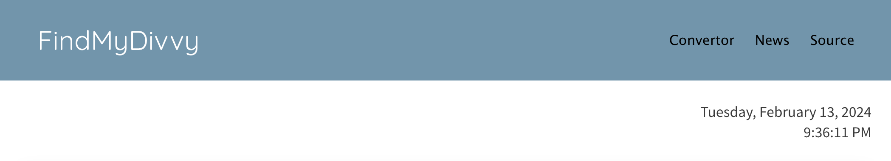
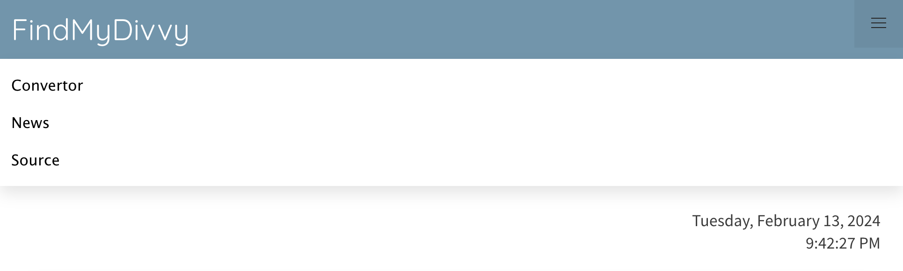
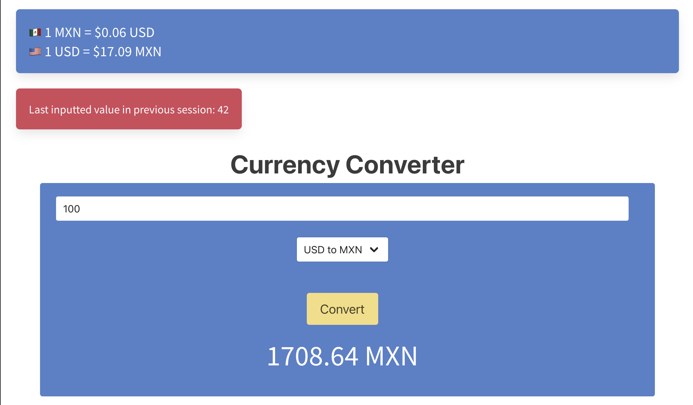
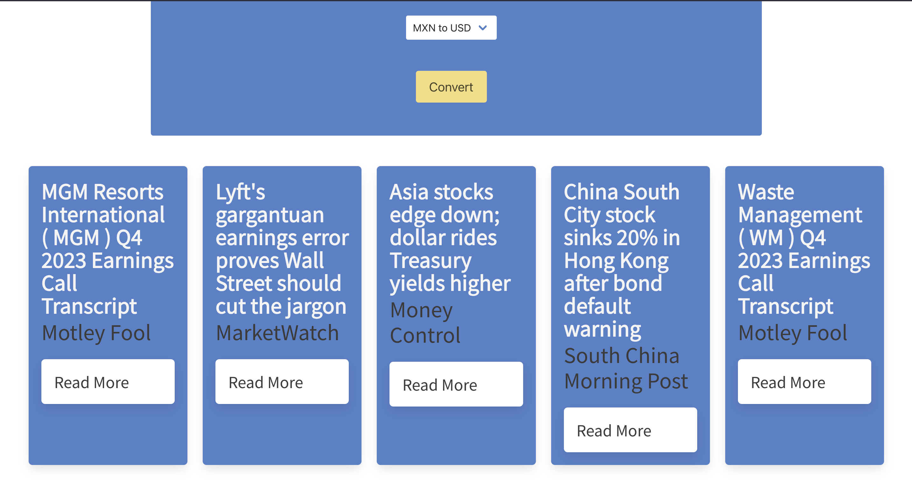

# FindMyDivvy

## Description

FindMyDivvy is a currency converter web application that allows users to convert between Mexican Pesos (MXN) and United States Dollars (USD) and vice-versa in real-time. Additionally, users can access the latest news related to finance and currency exchange rates.

## Installation

[Just click here to view the live webpage!](https://lage356.github.io/findMyDivvy/)

## Usage

`Navigation Bar` + `Date & Time`:
* __Accessing Sections__: The webpage features a navigation bar allowing users to access the Currency Converter or News sections quickly. This navigation feature enhances user experience by providing easy access to different sections of the webpage, as well as being responsive, displaying a hamburger icon when the page reaches 1023px and below.
* __Local date and time__: Date and time provided by jQuery based on the user's location is displayed and updates in real-time every second for reference to the user when converting and reviewing currency rates.

`Currency Conversion`:
* __Current Rate__: The webpages displays the current rate of 1 peso and 1 dollar which updates every second for the user's reference.
* __Input Form__: Users can enter whole and/or decimal numbers into the provided form input.
* __Convert Button__: Upon entering the desired amount and clicking the 'Convert' button, the application utilizes an API to instantly convert the entered amount to the desired currency.
* __Select element__: The user can choose between 'MXN to USD' and  'USD to MXN' from a dropdown list menu which automatically switches once an option is selected.
* __Local storage__: Furthermore, when the user reenters the page on another day, their latest input entered will be displayed within a red box.

`Latest News`:
Scrolling Feature: Users can scroll down the webpage to reveal the latest news related to finance and currency exchange rates.
Direct Link: Users have the option to visit the news article directly from the webpage, providing convenience and accessibility by clicking on the 'Read More' button.

)

## Technologies Used
* HTML/CSS: Used for structuring and styling the web page.
* JavaScript: Implemented to provide interactive features and real-time updates.
* API Integration: Utilized an API to fetch exchange rates and news updates.
* Bulma Framework: Employed for responsive design and layout.

## Credits

This webpage was created with the help of:
* The ‘Xpert Learning Assistant’ artificial intelligence developed by edX.
* The ‘ChatGPT’ artificial intelligence developed by OpenAI.
* The [Alpha Vantage](lihttps://www.alphavantage.co/nk) API for news.
* The [currency-api](https://github.com/fawazahmed0/currency-api) GitHub project for the currency converter API.

## License

This application was created by Fernando Lage, Alfonso Balderas, María Corona, Marcos Muñoz, and Carlos Rodriguez.
